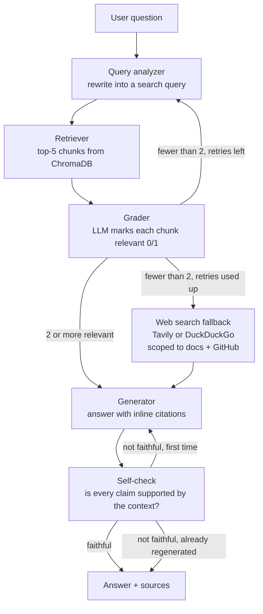
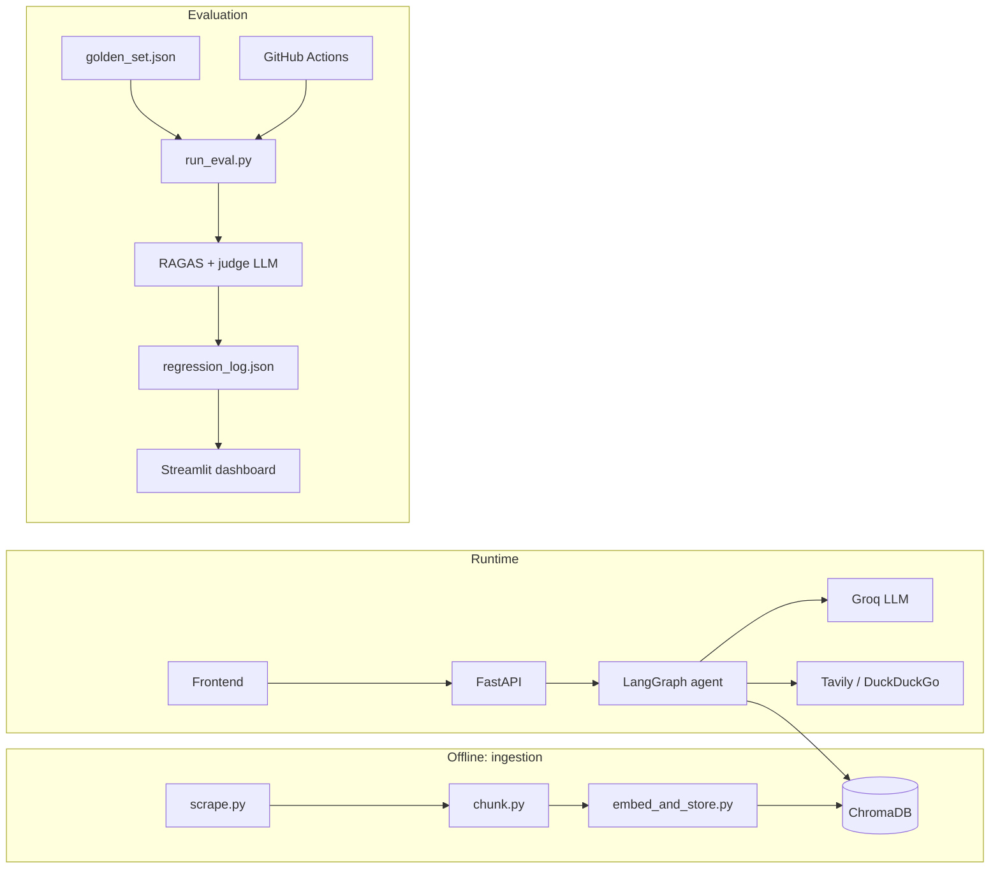

# GraphQA-Sentinel

A self-correcting RAG agent over the FastAPI documentation, with a continuous evaluation harness.

Unlike plain retrieve-then-generate RAG, GraphQA-Sentinel grades its own retrieval, rewrites the query and retries when retrieval is weak, falls back to a scoped web search when retries run out, and fact-checks its own draft answer against the retrieved context before responding. Every change to the system is meant to be measured against a hand-written golden set, with results tracked over time and a CI gate that fails on regression.

<!-- Add screenshots here once captured:


-->

## Status

| Milestone | State |
|---|---|
| M1 Ingestion pipeline | Done |
| M2 Baseline RAG | Done |
| M3 Golden evaluation set (47 questions) | Done |
| M4 Eval harness (RAGAS) | Implemented. Real baseline numbers pending (see [Known limitations](#known-limitations)) |
| M5 Agentic LangGraph pipeline | Done and served by the API. Scoring the agentic pipeline in the eval harness is pending |
| M6 Regression log + Streamlit dashboard | Done. Waiting on real eval runs to plot |
| M7 CI gate | Workflow in place. The deliberate-failure test has not been run yet |
| M8 Docker | Done and verified locally. Public deployment intentionally skipped (see [Deployment](#deployment)) |
| M9 README | This file |

## Architecture

### Agent graph



The agent is a LangGraph state machine (`agent/graph.py`), not a hand-rolled loop.

- **Query analyzer** rewrites the question into a retrieval-friendly query. On a retry it is told the previous query failed and asked for a genuinely different angle.
- **Grader** makes one batched LLM call that marks each retrieved chunk relevant or not. If its output is malformed it fails safe: no chunks count as relevant, which routes to a retry or the web fallback instead of answering from ungraded text.
- **Router** sends the flow to generation when at least 2 chunks are relevant. Otherwise it retries up to 2 times (3 attempts in total), then falls back to web search.
- **Web fallback** uses Tavily when `TAVILY_API_KEY` is set and a DuckDuckGo scrape otherwise, restricted to the docs domain and GitHub.
- **Generator** answers only from the supplied context and cites chunks inline as `[1]`, `[2]`.
- **Self-check** asks whether every claim in the draft is supported by the context. If not, the answer is regenerated once with a stricter prompt. There is no second regeneration.

### System overview



## Tech stack

| Layer | Choice |
|---|---|
| Orchestration | LangGraph |
| App LLM | Groq, `openai/gpt-oss-120b` |
| Embeddings | `BAAI/bge-small-en-v1.5` via sentence-transformers (local) |
| Vector store | ChromaDB (local persistence) |
| API | FastAPI, which also serves the frontend |
| Frontend | Single-page vanilla HTML, CSS, and JS with a small built-in markdown renderer |
| Ingestion | requests + BeautifulSoup (sitemap) + trafilatura (content extraction) |
| Web fallback | Tavily, with a DuckDuckGo scrape as the no-key fallback |
| Evaluation | RAGAS 0.4.x (faithfulness, answer relevancy, context precision, context recall) |
| Dashboard | Streamlit + Plotly |
| CI | GitHub Actions |
| Packaging | Docker |

## Repository structure

```
GraphQA-Sentinel/
├── ingestion/
│   ├── scrape.py              # sitemap crawl + trafilatura extraction to Markdown
│   ├── chunk.py               # split on Markdown headings, ~450-word chunks, 60-word overlap
│   ├── embed_and_store.py     # embed and write to Chroma with url/title/section metadata
│   └── verify_ingestion.py    # manual retrieval sanity check
├── agent/
│   ├── graph.py               # LangGraph state machine
│   ├── nodes.py               # query analyzer, retriever, grader, generator, self-check, routers
│   ├── tools.py               # web search fallback (Tavily / DuckDuckGo)
│   └── manual_test.py         # manual smoke test of the graph
├── api/
│   ├── main.py                # FastAPI app: /chat, /chat/baseline, /health, static frontend
│   └── rag_pipeline.py        # baseline retrieve-then-generate pipeline + shared helpers
├── frontend/
│   ├── index.html
│   └── style.css
├── eval/
│   ├── golden_set.json        # 47 hand-written Q/A pairs
│   ├── run_eval.py            # runs the golden set and scores with RAGAS
│   ├── metrics.py             # RAGAS metric wiring + judge LLM configuration
│   └── store.py               # append-only regression log
├── dashboard/
│   └── app.py                 # Streamlit trend dashboard
├── .github/
│   ├── workflows/eval.yml     # CI eval gate
│   └── scripts/check_regression.py
├── Dockerfile
├── requirements.txt
└── .env.example
```

`api/rag_pipeline.py` is not in the original plan's file list. The baseline pipeline lives there, separate from the FastAPI wiring, so the agent and the eval harness can reuse its retrieval and generation helpers.

## Setup

### Prerequisites

- Python 3.12 recommended. On Windows with Python 3.14, installing `ragas` pulls in `scikit-network`, which has no prebuilt wheel there and needs the Microsoft C++ Build Tools to compile.
- A [Groq](https://console.groq.com) API key.
- Optional: a [Tavily](https://tavily.com) API key for the web fallback (free tier at the time of writing: 1,000 credits/month, no card).

### Install

```bash
git clone https://github.com/<your-username>/GraphQA-Sentinel.git
cd GraphQA-Sentinel
python -m venv venv
source venv/bin/activate        # Windows: venv\Scripts\activate
pip install -r requirements.txt
cp .env.example .env            # Windows: copy .env.example .env
```

### Environment variables

| Variable | Required | Purpose |
|---|---|---|
| `GROQ_API_KEY` | yes | Groq API key. Used for the app LLM and, in the current configuration, the eval judge |
| `GROQ_MODEL` | recommended | App LLM. Set this explicitly. Model availability on Groq free accounts changes, and the code's built-in fallback may not exist on your account |
| `JUDGE_MODEL` | optional | Judge model for RAGAS scoring (see [Known limitations](#known-limitations)) |
| `TAVILY_API_KEY` | optional | Enables Tavily for the web fallback. Without it, a DuckDuckGo scrape is used |
| `CHROMA_PERSIST_DIR` | optional | Vector store location. Default `./chroma_store` |
| `TARGET_DOCS_URL` | optional | Docs site to ingest. Default `https://fastapi.tiangolo.com/` |

### Build the vector store

```bash
python ingestion/scrape.py
python ingestion/chunk.py
python ingestion/embed_and_store.py
python ingestion/verify_ingestion.py    # optional sanity check
```

Ingestion is source-agnostic. Point `TARGET_DOCS_URL` at another documentation site that publishes a `sitemap.xml` and re-run the three scripts.

### Run the app

```bash
uvicorn api.main:app --reload
```

Open http://localhost:8000. Endpoints:

- `POST /chat` runs the agentic pipeline and returns the answer, sources, and diagnostics (`retry_count`, `used_web_fallback`, `self_check_passed`).
- `POST /chat/baseline` runs plain retrieve-then-generate, kept for side-by-side comparison.
- `GET /health` is a liveness check.

### Run with Docker

The image bakes in the pre-built `chroma_store/`, so run ingestion first.

```bash
docker build -t graphqa-sentinel .
docker run --env-file .env -p 8000:7860 graphqa-sentinel
```

Then open http://localhost:8000.

### Evaluation and dashboard

```bash
python -m eval.run_eval --label baseline --limit 10
streamlit run dashboard/app.py
```

`--limit N` takes a stratified sample across question categories. Each run writes a detailed per-question file under `eval/results/` (gitignored) and appends one summary row to `eval/regression_log.json`, which the dashboard plots.

## Evaluation

**Golden set:** 47 hand-written question/answer pairs against the FastAPI docs: 16 factual, 17 multi-hop (need two or more doc sections), and 14 out-of-scope. Out-of-scope questions have empty `expected_sources`, and the system should decline them instead of inventing an answer. Some are deliberate false-premise traps, such as asking about FastAPI's "built-in ORM", which does not exist.

**Metrics (RAGAS):** faithfulness, answer relevancy, context precision (with reference), and context recall. The judge model is configured separately from the app LLM, with the aim of using a different model family to reduce self-preference bias in scoring.

**CI gate:** `.github/workflows/eval.yml` runs a stratified 10-question subset on every push and pull request and compares faithfulness against the previous CI run, failing the build on a drop of more than 5 points. A run in which fewer than 70% of questions could be scored is treated as unreliable: it fails loudly and does not write to the log, so an API outage cannot be recorded as a regression.

### Results

Real baseline and agentic numbers are not recorded yet. Placeholders are left here rather than filled with estimates.

| Metric | Baseline | Agentic | Change |
|---|---|---|---|
| Faithfulness | pending | pending | pending |
| Answer relevancy | pending | pending | pending |
| Context precision | pending | pending | pending |
| Context recall | pending | pending | pending |

## Example: what the agentic loop changes

Question: *"How do I connect FastAPI to a Kafka message queue?"* The docs contain no Kafka guide.

- **Baseline** retrieved the nearest chunks (WebSockets, server-sent events, JSON-lines streaming) and answered that the context does not contain the information.
- **Agentic** reworded the query and retried. In one run it surfaced a release-note entry linking an external Kafka/aiokafka article and explained that the docs only link to it, without implementation steps. In another run, after two rewrites, it gave the plain "not covered" answer.

The outputs vary between runs because the LLM calls are not deterministic, but in neither run did it invent instructions.

## Design decisions and deviations from the original plan

| Original plan | What was built | Why |
|---|---|---|
| App LLM: Llama 3.3 70B or Qwen3 32B on Groq | `openai/gpt-oss-120b` on Groq | Neither model was available on the Groq account used |
| Judge: Gemini 2.5 Flash | Judge configurable via `JUDGE_MODEL`; final choice pending | Gemini 2.5 Flash returned 404 for newly created keys, its 3.x-flash successor showed a 20 requests/day free quota on the account used, and ragas's native Google adapter had bugs in the pinned version |
| Scraper with a CSS selector | Theme-agnostic extraction with trafilatura | The FastAPI docs moved to a new static-site generator during the project, which broke the selector on every page |
| One grader call per chunk (allowed) | One batched grader call per retrieval | Fewer calls under tight free-tier limits |
| Single `/chat` endpoint | `/chat` (agentic) plus `/chat/baseline` | Keeps the M2 pipeline available for direct comparison |
| Public URL on a free host | Local Docker only | See below |

## Deployment

The plan called for a public URL on a free host. It was evaluated and deliberately not done, based on what was found in September 2026:

- **Hugging Face Spaces (Docker SDK):** creating a Docker Space on the free CPU tier required a PRO subscription at the time of writing, per community reports from July 2026, even though some documentation still described it as free.
- **Render free tier:** no card required, but web services are capped at 512 MB RAM. Loading torch, sentence-transformers, ChromaDB, and LangGraph together is likely to exceed that. Fitting would likely mean replacing the local embedding model with a lighter ONNX-based one.
- **Oracle Cloud Always Free and Google Cloud Run:** both have genuinely free usage allowances but require a payment card on file at signup.
- **Fly.io and Railway:** paid or credit-based.

The app is containerized and verified to run from its Docker image locally. A public deployment remains straightforward to do with any host that gives the container roughly 1 GB or more of RAM.

## Known limitations

- **Eval numbers are pending.** The free tiers used for the app and judge models impose per-minute and per-day token caps that a full golden-set run can exceed, since each question needs several judge calls and the agentic pipeline makes several app-LLM calls. Completing runs needs resumable, multi-day execution or a paid judge tier.
- **`run_eval.py` scores the baseline pipeline only.** Wiring the agentic graph in, including returning the contexts it actually used, is the next planned change.
- **The web fallback has not been exercised end to end.** It is implemented and routed, but every manual test question so far resolved from local retrieval.
- **Slow responses.** Each LLM call in the agent is followed by a fixed 6-second pause to stay under a free-tier tokens-per-minute cap, so a single question can take tens of seconds and longer when it retries.
- **Single-turn only.** Every question is answered independently, with no conversation memory, so follow-ups like "show that with async" fail.
- **Fixed corpus.** Users cannot upload their own documents. The corpus is whatever was ingested at build time.
- **Chunking is word-count based.** A long code block can be split across chunks, and sections under 20 words are dropped.
- **Fail-open self-check.** If the self-check's own output is malformed, the draft is accepted rather than regenerated.
- **Free-tier fragility.** Model availability and quotas on Groq and Gemini changed several times during development. The dependency stack also needed exact pins (for example `ragas` and `langchain-community`) to work together. Expect to revisit both.
- **No deployed demo.** See [Deployment](#deployment).

## Possible future work

- Multi-turn conversation memory, including resolving follow-up questions in the query analyzer.
- User-uploaded documents with per-session vector collections.
- A lighter embedding backend so the app fits in small free-tier containers.
- Resumable evaluation runs and a judge model with a larger daily budget.
